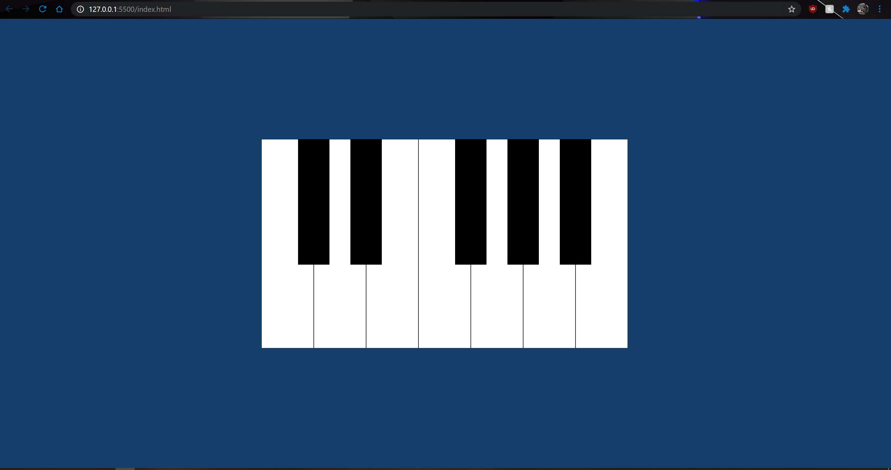

# Piano Web Application

## Background

I created this application with the intent of exploring javascript in-browser functionality. With this application, different keyboard buttons correspond to different piano keys and allow for the user to create a melody using their keyboard.

## Server Deployment

This application is not yet deployed on a server but can be run locally using the steps below.

Using node package manager (npm):

```
npm install nodemon
```

Once nodemon is installed, you can run the project locally.

```
nodemon script.js
```


## Application Use

The application, when run locally, should display something like this:


 

For white keys use the letters S-K on the keyboard. For black keys, the first pair are E and R and the trio of black notes is Y, U, I. You can also manually click on the piano keys to make each sound.

## Future Improvements

Future improvements include key labeling, a larger piano, and variable note durations.
